# Redis

<details>
<summary>Index</summary>

## Index

- Introduction
- Redis
- Setup
- Commands
- Datatypes
- Scenarios
- Documentation

</details>

---

<details>
<summary>Introduction</summary>

## Introduction

**Redis** stands for **Remote Dictionary Server**

- Remote: It's a server-based system accessible from other applications.
  - Store data: Write data to the Redis server.
  - Retrieve data: Read data from the Redis server.
  - Perform operations: Execute various commands on the stored data.
    - Ex : incrementing a counter
    - Ex : finding members in a set
- Dictionary: It stores data in `key-value` pairs.
  - Key: A unique identifier for a piece of data.
  - Value: The actual data associated with the key.
  - Ex : `name : "Ande Praveen"`

### Redis Server

- A Redis server is a high-performance computer system designed for storing and retrieving data extremely quickly.
- Data in **Redis** is organized using a `key-value` structure.
- We can say Redis is a NoSQL database.

### Why Redis is very Fast

- Redis uses the **RAM** for storage.
- Traditional Databases uses **Disk** for storage.
- RAM is more fast than the Disk.

### RAM

- **RAM** stands for **Random Access Memory**
- Redis uses the RAM
- This is the computer's high-speed memory.
- Redis stores all its data in RAM, allowing for very fast read and write operations.
- RAM is volatile, meaning data is lost when the server is turned off or restart.
- This is Server's short term memory.
- Computer memory (RAM) is much faster at finding and changing information compared to hard drives.

### Disk Storage

- Disk Storages are HDD or SSD.
- Traditional Databases (MySQL, Postgres, SQLite) uses Disk Storage.
- It's slower than RAM but provides persistent storage for data, meaning data will not lost when server turned off or restart.
- This is Server's long term memory.

</details>

---

<details>
<summary>Redis</summary>

## Redis

- Redis is a in-memory database.
- Redis is a temporary database.
- Permanent database purpose we need to use Traditional databases.
- An in-memory database is a type of database that stores all its data in the main memory (RAM) of a computer, rather than on disk storage.

### Why Redis Fast Real Example

I have some data that I will tell you. You have two options:

1. Write that data on papers and keep it in a drawer.
2. Store that data in your mind.

Later, I will ask you for that data.

1.  In the first scenario, you will have to take out the papers, read them, and then tell me.
2.  In the second scenario, since the data is already in your mind, you can tell me directly.

### Why we need to use Redis than Traditional Database ?

#### Example: Fetching user profile data.

- Traditional Database

  - Process:
    - Data is in several tables.
    - Joins are needed to get complete info.
    - Involves reading from disk, which is slower.

- Redis
  - Process:
    - Data is stored as one piece in memory.
    - Directly accessed using a simple key.
    - Very fast because it reads from memory.
- Summary
  - Traditional Database: Slower due to disk reads and complex joins.
  - Redis: Faster due to in-memory storage and simple access.

### Uses of Redis

- cache
- Database
- Message Broker
- Streaming Engine

### Redis Architecture

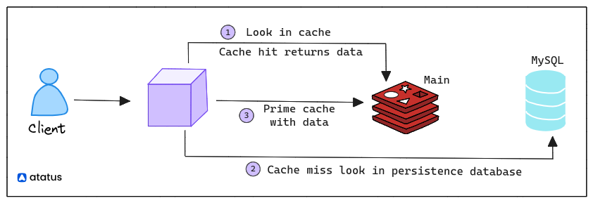
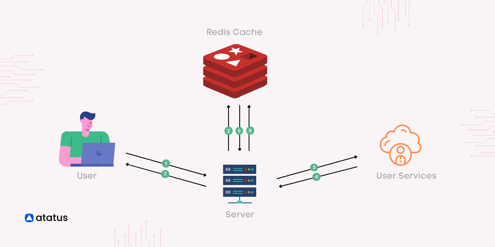

### Caching vs Memoization

- Use caching when you need to optimize access to frequently accessed data across different parts of your application or system.

- Use memoization when you need to optimize the performance of specific functions that are called repeatedly with the same inputs.

</details>

---

<details>
<summary>Setup</summary>

## Setup

### Install on windows

[https://redis.io/docs/latest/operate/oss_and_stack/install/install-redis/install-redis-on-windows/]

### Install on docker

1. Run the Redis on Docker : `docker run -d --name redis-stack -p 6379:6379 -p 8001:8001 redis/redis-stack:latest`
2. Connect redis cli : `docker exec -it redis-stack bash`
3. Connect to Redis : `redis-cli`
4. Check Redis : Input `ping` -> Output -> `PONG`
5. 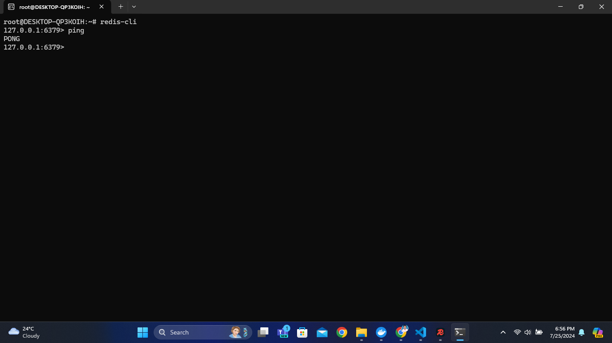

### Docker cmd Installation

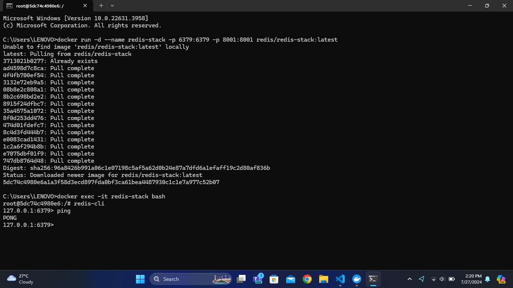

### Redis GUI

- GUI -> Graphical User Interface
- For development, you might also want to install `Redis Insight`, a visualization tool.
- 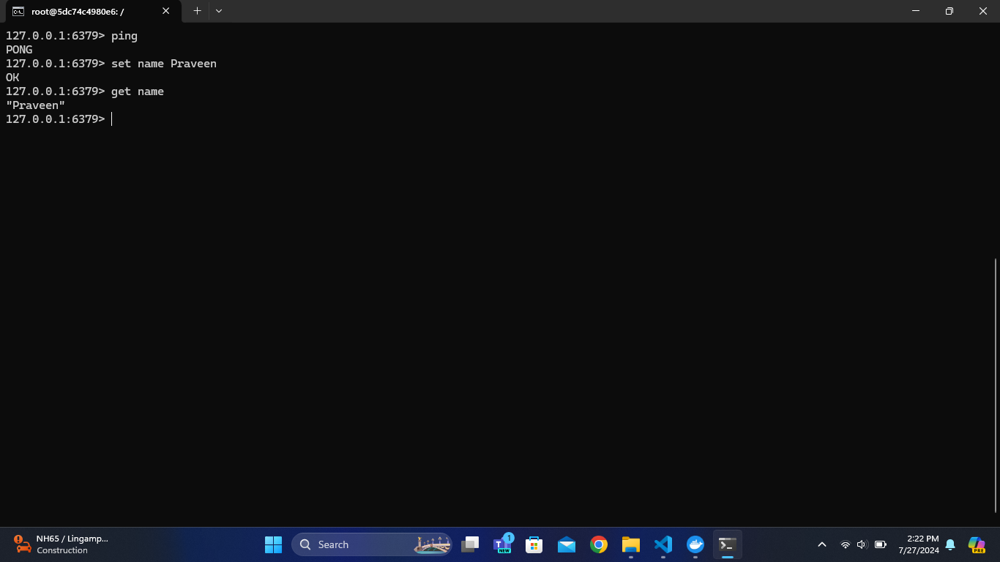
- 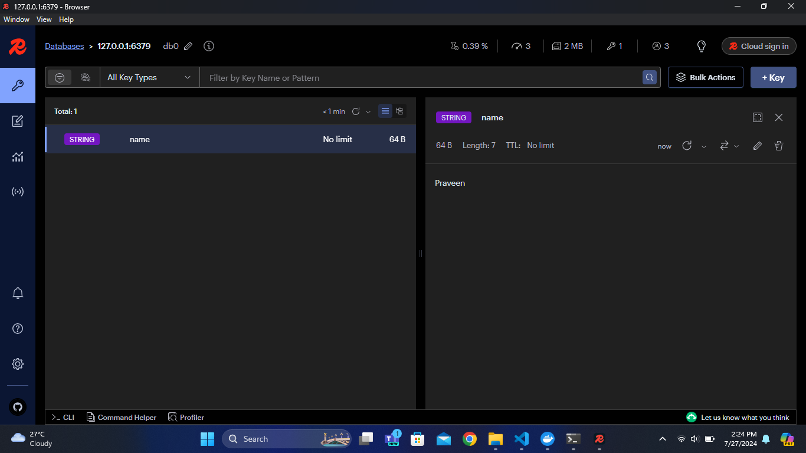

</details>

---

<details>
<summary>Commands</summary>

## Commands

### Set & Get

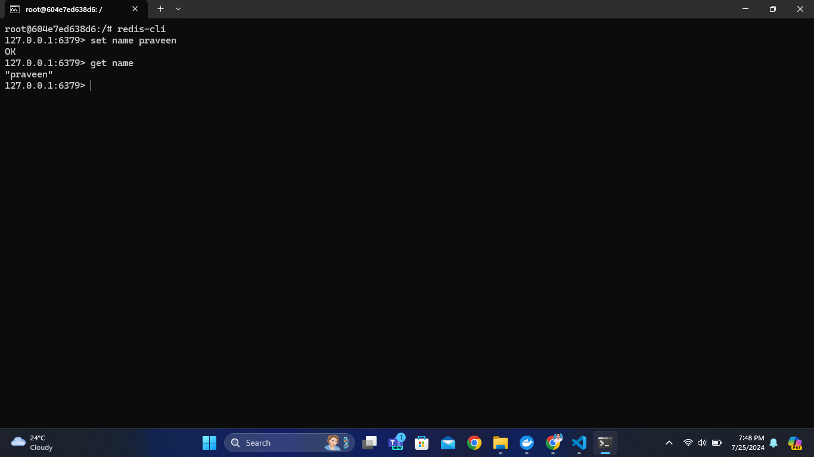

### Insert Data Syntax

- Normal - `<key> <value>`
- with Id - `<key>:<id> <value>`

```redis
set country India

set user:1 praveen
set user:2 prabhas
set user:3 Mahesh
```


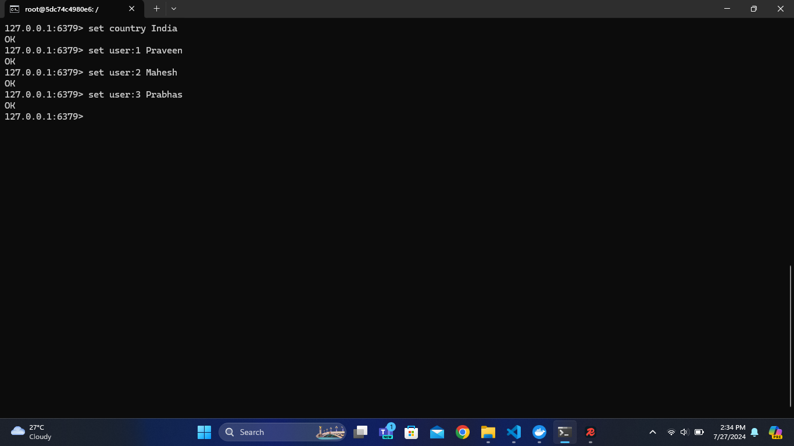

### Not Exchange

- nx : not exchange
- stores a string value only if the key doesn't exist.

```bash
  msg:1 Hello
```

```bash
# It will not replace, because msg:1 already existed
msg:1 How_are_you nx
```

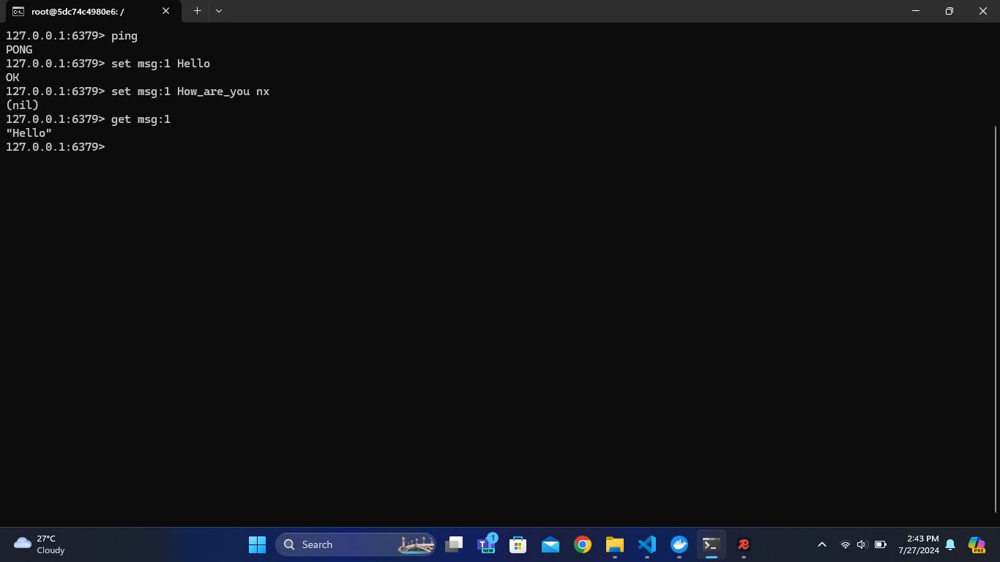

### Multiple Data Set & Get

- `mset` : Insert Multiple Data at a time

```bash
mset city:1 "Hyderabad" city:2 "Bangalore" city:3 "Pune"
```

- `mget` : Get multiple values at a time

```bash
mget city:1 city:2 city:3
```

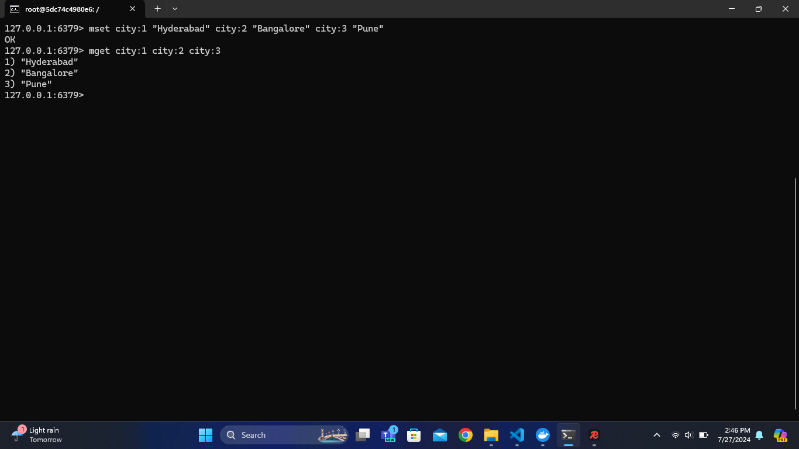

#### Delete the key

- `del keyName`
- `del cinema:1`

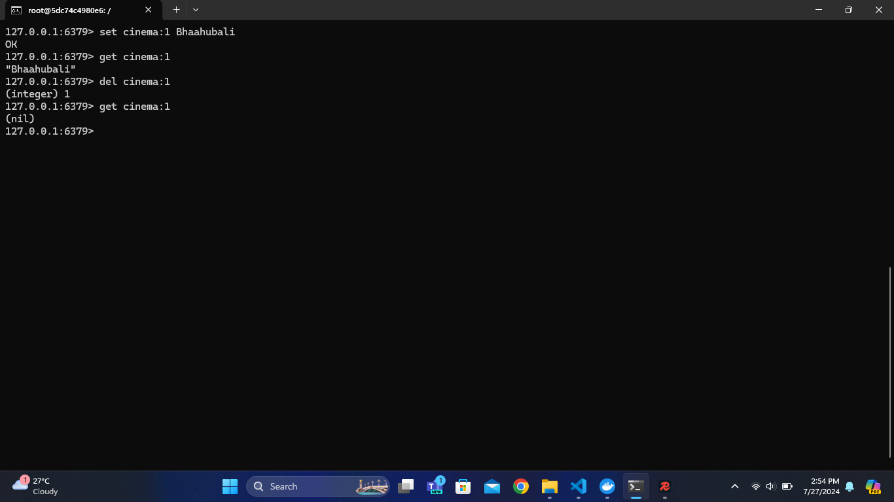

### Blocking Commands

- `BLPOP` - It removes and returns an element from the head of a list. If the list is empty, the command blocks untill an element becomes available or untill the specified timeout is reached.
- `BLMOVE` - It automatically moves elements from a source list to target list. If the source list is empty, the command will block until a new element becomes available.

</details>

---

<details>
<summary>Datatypes</summary>

## Datatypes

- Strings & Numbers
- Lists
- Sets

### Lists

### List Commands

- `LPUSH` - Left Push
- `RPUSH` - Right Push
- `LPOP` - Left Pop
- `RPOP` - Right Pop
- `LLEN` - Length of the list
- `LMOVE` - Move elements from one list to another
- `LTRIM` - reduces a list to the specified range of elements

### Set Commands

A Redis set is an unordered collection of unique strings.

- `SADD` : adds a new member to a set
- `SREM` : removes the specified member from the set
- `SISMEMBER` : Membership Check
- `SINTER` : Intersection
- `SCARD` : Size of a set
</details>

---

<details>
<summary>Scenarios</summary>

## Scenarios

1. Initial Data Fetch: When a user first requests the profile data, it is fetched from the source (e.g., a database) and stored in Redis with a cache expiration time of 30 seconds.

2. Profile Data Change: You update your profile data, but this change is not immediately reflected in the cache. If the cache has not expired yet, the cached data remains the same.

3. Subsequent Requests: If another user requests the profile data within the 30-second cache duration, they will receive the outdated profile data because the cache has not been refreshed with the updated information.

### Solutions

- Shorter Cache Duration : Reduce the cache expiration time to minimize the duration during which stale data might be served.

- Cache Invalidation : Implement cache invalidation strategies to explicitly remove or update the cache when the profile data changes.

- Cache Versioning : Use versioning in your cache keys. When data is updated, increment a version number in the cache key so that requests for profile data fetch the latest version.

  - Key format: `profile:{userId}:v{version}`
  - Increment `version` whenever data is updated.

- Real-Time Updates : If real-time updates are crucial, consider using other methods such as WebSockets or Server-Sent Events (SSE) to push updates to clients.
  - **WebSockets**: Establish a persistent connection allowing bi-directional communication between the client and server.
  </details>

---

<details>
<summary>Documentation</summary>

## Documentation

- Commands Cheatsheet : [https://redis.io/learn/howtos/quick-start/cheat-sheet]
- Datatypes : [https://redis.io/docs/latest/develop/data-types/]
- Blog : [https://daily.dev/blog/redis-basics-for-new-developers]
- Redis Commands : [https://redis.io/docs/latest/commands/]
- Redis Cheatsheets : [https://quickref.me/redis]

</details>

---
